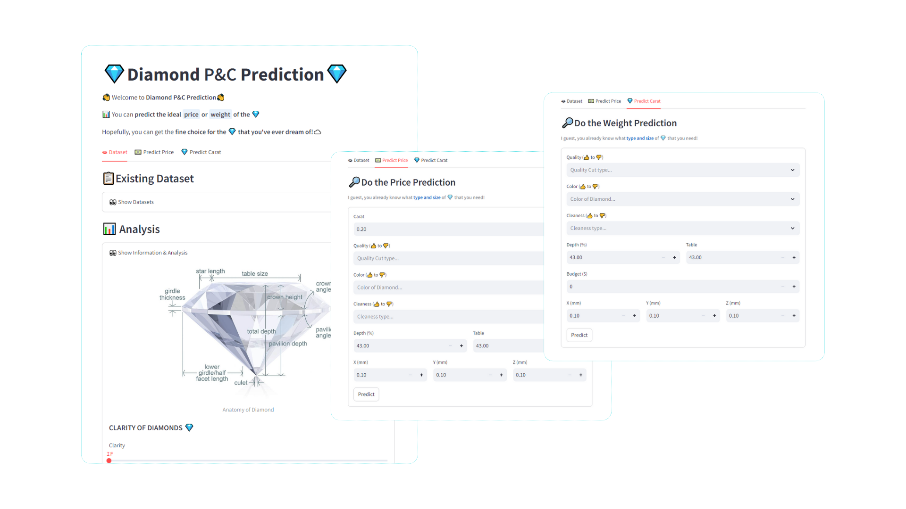

<h1 align="center">💎Diamond Price Prediction💎</h1>
<h3 align="center"><b>"Shine bright like a diamond"</b> -Rihana</h3>
<h4 align="center"><i>which diamond?</i></h4>
<p align="center">
  
</p>


## 🚀 About Diamond Prediction
This 💎Diamond Prediction Web-App provide a little information about Diamonds and slice of the Analysis about the distribution of Diamond itself. Also provides two prediction, Price and Weight of Diamond based on users preference.

<p align="center">
  
</p>

### 📜 What does it do?

This 💎Web-App allows you to predict Price and Weight of Diamonds based on your preference. What users need to do is read the tab `Information` first and see the analysis there to help users decide which quality, color, size that inline to the preference. Then, users can predict the Price or Weight of Diamonds based on what they have analyzed or identified. 

### 🔧 How does it work?

Built with Streamlit and it encapsulates a comprehensive Python environment that includes all necessary libraries. The Web-App only playing with Python and Streamlit function to provide everything inside (visualization, prediction, etc.)


## ⚙️Install
1. **Clone the repository** `$ https://github.com/ditherr/diamond-price-prediction.git`
2. Go to the local folder (`../diamond-price-prediction`) based on clone above.
2. **Create a New Environment**
    ```
    conda create -p venv python==3.10.12 -y
    ```

3. **Activate The Environment**
    ```
    conda activate venv/
    ```

4. **Install The Requirements**
    ```
    pip install -r requirements.txt
    ```

## 👑Streamlit Application
You can Run it with two methods:
1. Run on the (Web) Cloud:
    🔗: [💎 Diamond Prediction](https://diamond-prediction.streamlit.app/)
2. Run on the Local:
    ```
    streamlit run app.py
    ```

## 📁Local Runner
Run below code to get [*dataset (raw + split) and model pipeline*]
```
python local_run.py
```
The iniate pipeline for the model that used here is `XGBRegressor`. You can change the initiate pipeline model by go to `src/components/transform_training.py`, then search `final_pipeline`. There you can change the model variable and the parameter in it.

## ⚙️Library Versioning
**🐍Built with Python Version 3.10.12**

**📦List of Library versions used (*last time installed*)**:
```
    ipykernel
    pandas==2.1.4
    numpy==1.26.4
    matplotlib==3.9.2
    seaborn==0.13.2
    scikit-learn==1.5.1
    catboost==1.2.6
    xgboost==2.1.1
    streamlit==1.38.0
    plotly==5.24.0
```


### Documentation
1. [Kaggle - Diamond Dataset](https://www.kaggle.com/datasets/shivam2503/diamonds)
2. Notebook: [karnikakapoor](https://www.kaggle.com/code/karnikakapoor/diamond-price-prediction/comments), [surajjha101](https://www.kaggle.com/code/bhuvanchennoju/s-s-experimets-fun-with-r2-99-21), + + +
3. [Brilliance - Diamonds education](https://www.brilliance.com/education/diamonds)
4. [Diamonds.pro](https://www.diamonds.pro/education/clarity/)
5. [Plotly Documentations](https://plotly.com/python/)
6. [Streamlit Documentations](https://docs.streamlit.io/)
7. ...